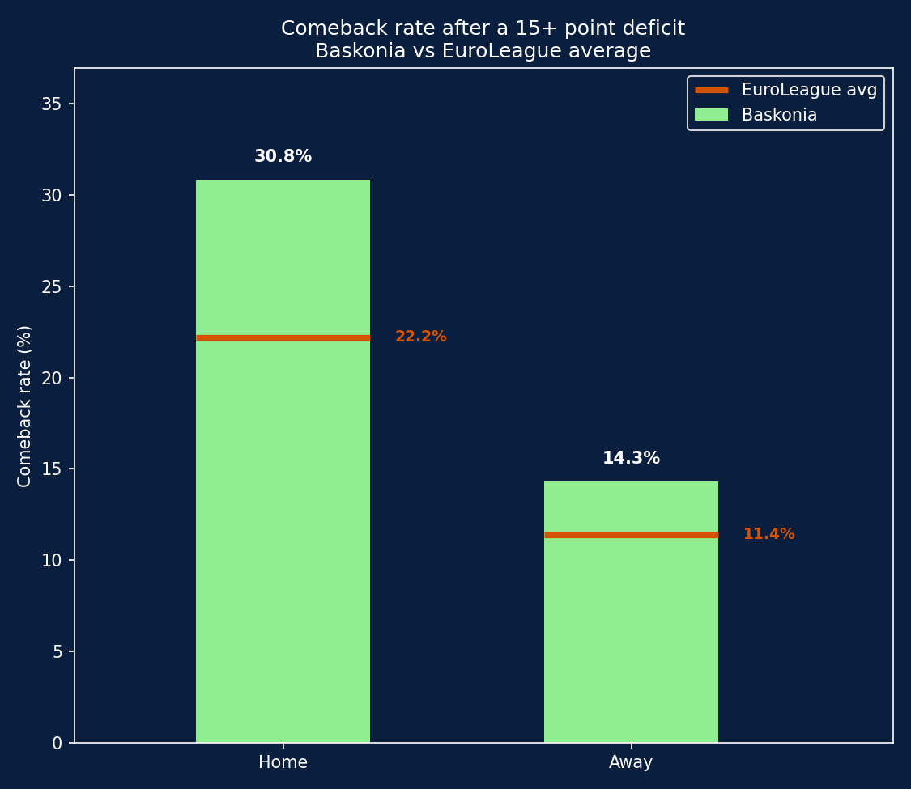

# Baskonia: Debunking (and Confirming) the Comeback Myth

A play-by-play data analysis testing a specific claim about home court advantage: does the Fernando Buesa Arena crowd genuinely help Baskonia come back from big deficits?

## Background

Baskonia's Fernando Buesa Arena has a reputation as one of the loudest, most intense atmospheres in EuroLeague basketball. This project tests a concrete version of that claim using play-by-play data: **when Baskonia falls behind by a large margin, does it recover more often at home than on the road — and more often than the rest of the league?**

Rather than relying on anecdote, the analysis is built directly from event-by-event scoring data across nearly two decades of EuroLeague games.

## Data & Tools

- **Data source**: [Euroleague & Eurocup Datasets](https://www.kaggle.com/datasets/babissamothrakis/euroleague-datasets) (Kaggle) — specifically the play-by-play file, which logs every individual event (shots, rebounds, fouls, turnovers, etc.) with a running score
- **Tools**: Python, pandas, matplotlib, statsmodels, scipy
- **Scope**: 541 Baskonia games (all seasons available), plus the full EuroLeague play-by-play dataset (2.6M+ events) for league-wide comparison

## Defining "Comeback"

Before running any analysis, it's worth being explicit about what counts as a real comeback since a vague definition would make the whole exercise meaningless.

An initial idea was to check the score at the exact start of the 4th quarter and see how often a 10-point deficit at that point turned into a win. This produced a very clean setup, but the results were nearly unusable: Baskonia came back from a 10-point 4th-quarter deficit only twice in over 100 chances (1 out of 32 at home, 1 out of 90 away); that is, the event was too rare to say anything meaningful about it.

The final, more robust definition:

1. Find the **single worst deficit** Baskonia faced at any point during the game (not just at the start of the 4th quarter)
2. Only consider games where that deficit was **15 points or worse**
3. Check whether, from that low point onward, the score was tied or Baskonia took the lead at any point before the final buzzer

This is a lower bar than "won the game", indeed it asks "did the team show it could climb back into contention," not "did it complete the entire comeback and win." That trade-off is deliberate: it produces a large enough sample to say something statistically meaningful, while still requiring a real, sizeable deficit (15+ points) to qualify.

## Results: Baskonia vs EuroLeague Average

| Venue | Baskonia comebacks | Baskonia games (15+ deficit) | Baskonia rate | League comebacks | League games (15+ deficit) | League rate |
|---|---|---|---|---|---|---|
| Home | 16 | 52 | **30.8%** | 217 | 978 | 22.2% |
| Away | 17 | 119 | **14.3%** | 213 | 1,864 | 11.4% |

Two things stand out immediately:

1. **The league-wide home advantage is real**: across all of EuroLeague, teams recover from big deficits nearly twice as often at home (22.2%) as on the road (11.4%). This isn't unique to Baskonia. It's a structural feature of the sport.
2. **Baskonia outperforms the league average in both settings**, but the gap is far more pronounced at home (+8.6 points over the league average) than away (+2.9 points).

## Is the Gap Statistically Significant?

A large percentage gap doesn't automatically mean a real effect (with a relatively small sample of "big deficit" games - 52 at home, 119 away), some of that gap could be due to chance. Two standard tests for comparing proportions were run to check:

| Venue | Two-proportion z-test (p-value) | Fisher's exact test (p-value) | Odds ratio (Fisher) |
|---|---|---|---|
| Home | 0.14 | 0.17 | 1.56 |
| Away | 0.35 | 0.37 | 1.29 |

Neither test reaches the conventional significance threshold (p < 0.05) in either venue. In plain terms: **the pattern observed in the data is real, but the sample isn't large enough to rule out chance as an explanation**, particularly away from home, where the gap is small to begin with.

The home gap comes closer to significance and has a larger effect size (odds ratio of 1.56, meaning Baskonia's odds of a comeback at home are about 56% higher than the league average), so it's the more interesting of the two results, but it should be read as *suggestive*, not *confirmed*.

## Takeaways

- **A 10-point deficit at the start of the 4th quarter is too rare an event to analyze reliably** for a single team, redefining the metric around the game's overall worst deficit (15+ points, any point in the game) produced a far more usable sample
- **Home court advantage on comebacks is a real, league-wide pattern** in EuroLeague, not something specific to Baskonia
- **Baskonia's comeback rate is higher than the league average both home and away**, and the gap is considerably larger at home, consistent with (though not proof of) the Fernando Buesa Arena's reputation
- **Statistical testing (z-test and Fisher's exact test) does not confirm the difference as significant** at conventional thresholds, mainly due to sample size — a useful reminder that an interesting pattern in the data isn't the same as a proven effect
- A larger sample (e.g. a lower deficit threshold, or pooling multiple seasons of a wider set of "loud arena" teams) would be needed to state this claim with more statistical confidence

## How to Reproduce

1. Download the [Euroleague & Eurocup Datasets](https://www.kaggle.com/datasets/babissamothrakis/euroleague-datasets) from Kaggle
2. Place `euroleague_header.csv` and `euroleague_play_by_play.csv` in a `csv_euroleague` folder
3. Run the analysis script (requires `pandas`, `matplotlib`, `statsmodels`, `scipy`)

Note: processing the full league-wide play-by-play file (2.6M+ rows) takes a couple of minutes to run.

## About

This project combines a background in basketball coaching (8 years, youth and regional level) with data analysis.
